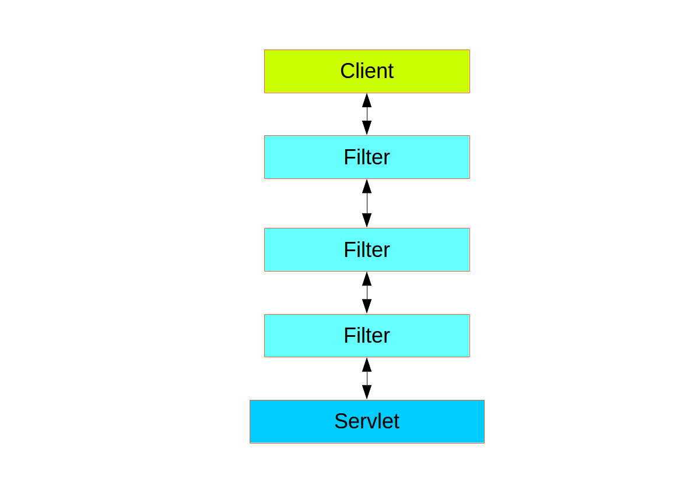

Official Documentation: [Spring Security Architecture](https://spring.io/guides/topicals/spring-security-architecture)

Spring Security can be added to a Spring project using it's Starter dependency.

`<dependency>`  
            `<groupId>org.springframework.boot</groupId>`  
            `<artifactId>spring-boot-starter-security</artifactId>`  
`</dependency>`

Once deployed, the first contact that comes from a client is through an API. So, the first request is the entry point. Spring's API's URL is exposed and after it is triggered, the flow then goes through Filters. Spring Security in the web tier is based on Filter.

Client sends request to the application. **The Spring Container** decides which filters and which servlet apply it based on the path of the request URI. Filters form a chain and are ordered. 

Spring Security is installed as a single Filter. But, inside of it, there are additional filters, each playing a special role.

The Spring Security **FilterChainProxy** dispatches requests to the first chain of Filters that matches.

At this point, it will help to know that Spring Security Filter chain is equivalent to `WebSecurityConfigurerAdapter`.

In this project, `WebSecurityConfig`, extends `WebSecurityConfigurerAdapter` which overrides a `configure(HttpSecurity http)` method which causes Spring Secuirty to add a new filter chain and order it before fallback. The last line in that method, we give commands to Spring Container to add  `AuthTokenFilter` Filter before `UsernamePasswordAunthenticationFilter.class`. 

Here's an explanation to the code present in `WebSecurityConfig`:

- `@EnableWebSecurity` allows Spring to find and apply the class to global Web Security of the entire Spring Boot Application.

- `@EnableGlobalMethodSecurity` provides AOP security on methods. It enables @PreAuthorize, @PostAuthorize, it also supports JSR-250. 

- We override `configure(HttpSecurity http)` method from `WebSecurityConfigurerAdapter`. It tells Spring Security how we configure CORS, CSRF, when we want to require all users to be authenticated or not, which filter we want to work with before which. And also which Exception Handler is used. `AuthEntryPointJwt` is used here.

- `UserDetailsService` will be used for loading User Details to perform authentication and authorization. It'll also be used for configuring `DaoAuthenticationProvider` by AuthenticationManagerBuilder.userDetailsService() method.

- We'd need a `PasswordEncorder` for the `DaoAuthenticationProvider`. Otherwise, it'll use plain text.

- In `AuthController`, we can get User's Information: username, password, authorities from Authentication object. 

`Authentication authentication = authenticationManager.authenticate(new UsernamePasswordAuthenticationToken(loginRequest.getUsername(), loginRequest.getPassword()));`
				
- Any more data that we want, we can get it by creating implementation of `UserDetails` interface.

- We've defined implemented `OncePerRequestFilter` in `AuthTokenFilter` makes a single execution for each request to our API. It provides a `doFilterInternal()` method that we will implement parsing and validating JWT, loading User details (using 'UserDetailsService'), checking Authorization (using `UsernamePasswordAuthenticationToken`)

- `AuthenticationEntryPoint` will catch Authentication Error. Here we override `commence()` method. This method will be triggered anytime anautheticated User requests a secured HTTP resource and an `AuthenticationException` is thrown.

We can secure methods in our controller using `@PreAuthorize` annotation. This was possible due to `@EnableGlobalMethodSecurity(prePostEnabled = true)` that we used in `WebSecurityConfig` class.

*Any more explanations will be added later if necessary.*

